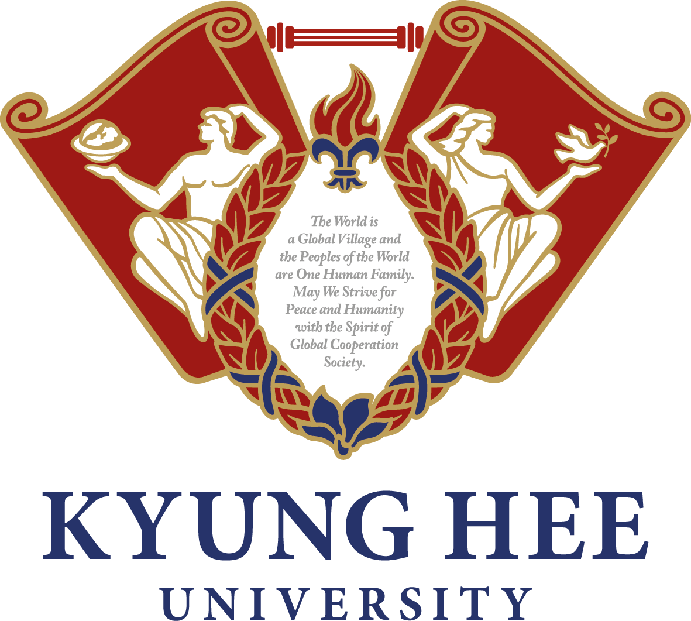
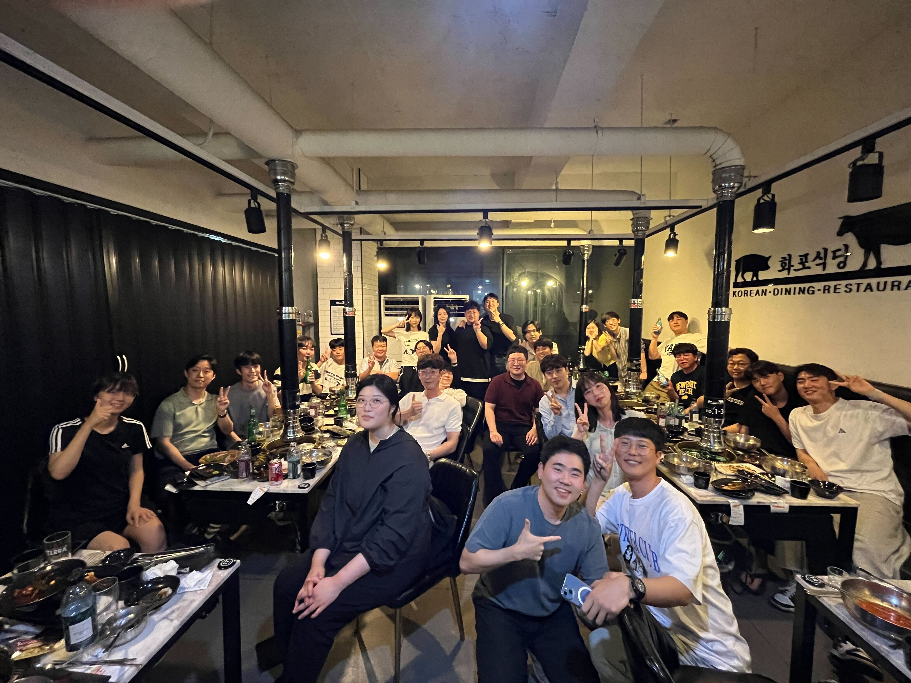

# KHU Vision and Learning Reading Group 

Time
- Wednesday AM 11:00

Location 
- 211-1 Electronic Information College Building

## Table of Contents

- [Current Schedule (Winter 2024)](#current-schedule)
- [Mailing List](#mailing-list)
- [Presenter](#presenters)
- [Previous Meetings](#previous-meetings)
- [Related Links](#related-links)
- [FAQ](#faq)
- [About Us](#about-us)
- [Suggested Papers](#suggested-papers)

## Current Schedule

### Reading Group: 
Please let Soyeon Hong (soyeonhong -at- khu -dot- ac -dot- kr) know what paper you are going to present, and **please** provide (name and year) of the conference the paper was accepted and summary by **Thursday 11:59pm** before your presentation.

Moreover, send the **presentation slides link** on  **Tuesday 11:59am**.

This Winter we will have Two presenters each week. Presentation duration is up to the presenter (as long as it does not go over an hour:hourglass:).

| Date       | Presenters     |  Topic     |
|-------------|--------|--------|
| 01/03 |   Min-Yeong Park      Geo Ahn   | Hierarchical Decomposition of Prompt-Based Continual Learning: Rethinking Obscured Sub-optimality [[Liyuan Wang, et al., NeurIPS 2023](https://arxiv.org/pdf/2310.07234.pdf)] [[slides](https://docs.google.com/presentation/d/15BfoJx0TjiSPdUOOsy92gKzMBFre9_CAVwp5CxUKs34/edit#slide=id.g2ab63a65308_1_40)]    QVHighlights: Detecting Moments and Highlights in Videos via Natural Language Queries [[Jie Lei, et al., NeurIPS 2021](https://arxiv.org/pdf/2107.09609.pdf)] [[slides](https://docs.google.com/presentation/d/1WhaASVDE10fKNUHfFqobsEvA7mGsXgFnbeSq2LqJa2A/edit#slide=id.p)]|
| 01/10 |  Ohsung Choo      Min-Jae Kim   |Proposal-based Multiple Instance Learning for Weakly-supervised Temporal Action Localization [[Huan Ren, et al., CVPR 2023](https://arxiv.org/pdf/2305.17861.pdf)] [[slides](https://docs.google.com/presentation/d/1bZsOTwlCpcKcLYetT8rerxXSr5wU4v8H/edit#slide=id.p1)]    Calibrating Multimodal Learning [[Huan Ma, et al., ICML 2023](https://arxiv.org/pdf/2306.01265.pdf)] [[slides](https://docs.google.com/presentation/d/16Q_WTcMOe9fokbGVlOa1Ad1m46WrOR5s/edit#slide=id.p1)]|
| 01/17 |  Jun-Yeong Moon       Kyungho Bae   |Squeeze, Recover and Relabel: Dataset Condensation at ImageNet Scale From A New Perspective [[Zeyuan Yin et. al., NeurIPS 2023](https://arxiv.org/pdf/2306.13092.pdf)] [[slides](https://docs.google.com/presentation/d/18XlUaj8tTDjA2fkPY2byOnDjhzyTMm7O7usB6tBdOKc/edit?usp=sharing)]    Masked Autoencoding Does Not Help Natural Language Supervision at Scale [[Floris Weers et al., CVPR 2023](https://openaccess.thecvf.com/content/CVPR2023/papers/Weers_Masked_Autoencoding_Does_Not_Help_Natural_Language_Supervision_at_Scale_CVPR_2023_paper.pdf)] [[slides](https://docs.google.com/presentation/d/15rof145mJe6BYa5bE4LGegtnNs8JiQ9oHxAVIjysqIs/edit?usp=sharing)]|
| 01/24 |  Joohyun Chang       Myeongjun Oh   |Revealing Single Frame Bias for Video-and-Language Learning [[Jie Lei et al., ACL 2023](https://arxiv.org/pdf/2206.03428v1.pdf)] [[slides](https://docs.google.com/presentation/d/1LQwDJxdBZxfBdbAxPZZQZXt42MZLpqch/edit#slide=id.p1)]    NeRFLight: Fast and Light Neural Radiance Fields Using a Shared Feature Grid [[Fernando Rivas- Manzaneque et al., CVPR 2023](https://openaccess.thecvf.com/content/CVPR2023/papers/Rivas-Manzaneque_NeRFLight_Fast_and_Light_Neural_Radiance_Fields_Using_a_Shared_CVPR_2023_paper.pdf)] [[slides](https://docs.google.com/presentation/d/1fiiv3QalQ2HBhuNb-avPwNb1dM9W6dDl/edit#slide=id.p1)]|
| 01/31 |  CVPR Rebuttal   |No Reading Group. 📖|
| 02/07 | Keonhee Park       Minkuk Kim   |Proxy Anchor-based Unsupervised Learning for Continuous Generalized Category Discovery [[Hyungmin Kim et al., ICCV 2023](https://arxiv.org/pdf/2307.10943.pdf)]  [[slides](https://docs.google.com/presentation/d/1fo-A5Tkgsp7et_gHsj8yYGrmxKihi5fzpork4KHgAVk/edit#slide=id.p1)]    AutoAD: Movie Description in Context [[Tengda Han et al., CVPR 2023](https://arxiv.org/pdf/2303.16899.pdf)] [[slides](https://docs.google.com/presentation/d/1zX11FxXaRvDOTLg7VO83vuyyuei7sKahdbKOQdkFoDw/edit#slide=id.p1)]|
| 02/14 | Juwon Seo     Seun-An Choe    |Your Diffusion Model is Secretly a Zero-Shot Classifier [[Alexander C. Li et al., ICCV 2023](https://arxiv.org/abs/2303.16203)] [[slides](https://docs.google.com/presentation/d/1J7QaUQNwzYCk8vQqP6u_AYkS610uHpiAOXx8el_9V7s/edit#slide=id.p)]    Towards Open-Set Test-Time Adaptation Utilizing the Wisdom of Crowds in Entropy Minimization [[Jungsoo Lee et al., ICCV 2023](https://arxiv.org/pdf/2308.06879.pdf)] [[slides](https://docs.google.com/presentation/d/1GMLCPEQAHnOwfPMkkbwkj5GWW1atguOdR5vpEfgLVaM/edit#slide=id.g2b89b229458_0_296)]|
| 02/21 |  2023 Early Graduation Ceremony   |No Reading Group. Congratulations on your graduation! 🎓|
| 02/28 |  Yebin Ji       YongHyun Ahn  |What Do Deep Saliency Models Learn about Visual Attention? [[Shi Chen et al., NeurIPS 2023](https://arxiv.org/pdf/2310.09679.pdf)] [slides]    WWW: A Unified Framework for Explaining What, Where and Why of Neural Networks by Interpretation of Neuron Concept [[Yong Hyun Ahn et al., CVPR 2024](https://arxiv.org/pdf/2402.18956.pdf)] [[slides](https://drive.google.com/file/d/1gAQ8E3eTQifbgol_8BIlQtk_im3Cl2Z0/view?usp=sharing)]|

## Mailing List

We use Google Groups to manage the mailing list: [(link)](https://groups.google.com/u/2/a/khu.ac.kr/g/khu-vision-and-learning-reading-group-g-groups). You can click "Join Group" when you sign in with your Kyung Hee University account.

## Presenters
Please let Soyeon Hong (soyeonhong -at- khu -dot- ac -dot- kr) know what paper you are going to present, and **please** provide (name and year) of the conference the paper was accepted and summary by **Thursday 11:59pm** before your presentation.
Moreover, send the **presentation slides link** on  **Tuesday 11:59am**.

* [AGI](https://agi.khu.ac.kr/index.html)
  - M.S. student : Sunghoon Lee / Jiwon Hwang / Jaeho Lee / Juwon Seo / Jun-Yeong Moon / Keonhee Park /  Seun-An Choe / Min-Yeong Park / Taeyoung Lee
  - UG student : Min-Jae Kim
* [AUGI](http://ailab.khu.ac.kr/)
  - M.S. student : Enki Cho / Yong Hyun Ahn / Minkuk Kim / Soyoun Won / Hyeonbae Kim / Yebin Ji
  - UG student : Ohsung Choo
* [MLVC](https://sites.google.com/khu.ac.kr/mlvclab/home?authuser=0)
  - UG student :  Euijune Lee / Myeongjun Oh
* [VLL](https://vll.khu.ac.kr/index.html)
  - M.S. student : Hyogun Lee / Kyungho Bae / Jongseo Lee
  - UG student : Geo Ahn / Soyeon Hong / Joohyun Chang
* Alumni
  - \[AGI] M.S. : Ahyung Shin
  - \[MLVC] M.S. : Junghun Cha
  - \[VLL] M.S. : Dongho Lee / Jongmin Shin

## Previous Meetings

- [Summer~Fall 2021](https://github.com/khuvll/reading_group/blob/main/2021_Summer_Fall_schedule.md)
- [Winter 2022](https://github.com/khuvll/reading_group/blob/main/2022_Winter_schedule.md)
- [Spring 2022](https://github.com/khuvll/reading_group/blob/main/2022_Spring_schedule.md)
- [Summer 2022](https://github.com/khuvll/reading_group/blob/main/2022_Summer_schedule.md)
- [Fall 2022](https://github.com/khuvll/reading_group/blob/main/2022_Fall_Winter_schedule.md)
- [Winter~Spring 2023](https://github.com/khuvll/reading_group/blob/main/2023_Winter_Spring_schedule.md)
- [Summer 2023](https://github.com/khuvll/reading_group/blob/main/2023_Summer_schedule.md)
- [Fall 2023](https://github.com/khuvll/reading_group/blob/main/2023_Fall_schedule.md)

## Related Links

#### Resources
- [Awesome Computer Vision](https://github.com/jbhuang0604/awesome-computer-vision)
- [Awesome Deep Vision](https://github.com/kjw0612/awesome-deep-vision)
- [Awesome Action Recognition](https://github.com/jinwchoi/awesome-action-recognition)
- [Computer Vision Foundation open access](http://openaccess.thecvf.com/menu.py)

#### Similar reading group/seminars in other universities
- [MIT Vision Seminars](https://sites.google.com/view/visionseminar)
- [UIUC Vision Lunch](http://vision.cs.illinois.edu/vision_website/)
- [UT-Austin CV Reading Group](http://vision.cs.utexas.edu/readinggroup/)
- [CMU VASC Seminar Series](http://ri.cmu.edu/events/category/vasc-seminar-series/list/?tribe_paged=1&tribe_event_display=past)
- [CMU ML Reading Group](http://www.cs.cmu.edu/~aarti/SMLRG/schedule.html)
- [VT Vision and Learning Reading Group](https://github.com/vt-vl-lab/reading_group)
- [딥러닝 논문 읽기 모임 @ TensorFlow Korea Facebook Group](https://www.youtube.com/playlist?list=PLXiK3f5MOQ760xYLb2eWbtOKOwUC-bByj)

#### Advanced CV courses
- [Advanced Computer Vision](https://filebox.ece.vt.edu/~jbhuang/teaching/ece6554/sp17/index.html) (Jia-Bin Huang, Virginia Tech)
- [Object and Activity Recognition Seminar](https://sites.google.com/site/ucbcs29443/) (Trevor Darrell, UC Berkeley)
- [Visual Learning and Recognition](http://graphics.cs.cmu.edu/courses/16-824/2017_spring/) (Abhinav Gupta, CMU)
- [Visual Recognition](http://vision.cs.utexas.edu/381V-fall2016/) (Kristen Grauman, UT Austin)
- [Advanced Computer Vision](https://filebox.ece.vt.edu/~S16ECE6554/) (Devi Parikh, Georgia Tech)
- [Cutting-Edge Trends in Deep Learning and Recognition](http://slazebni.cs.illinois.edu/spring17) (Svetlana Lazebnik, UIUC)

## FAQ
#### How is the presenters' order generated?
The presenters' order is generated from the presenters' list in a FIFO manner (but the list is initially generated randomly).

#### What should I do if I can not present at the scheduled time?
Contact other presenters to see if they are willing to swap dates with you. Let the group organizer Soyeon Hong (soyeonhong -at- khu -dot- ac -dot- kr) know about your situation.

## About Us

#### How it works?
We are a group that meets about once a week to discuss one to two relevant papers. For every meeting, two people will be in charge of selecting the paper(s) for that meeting, thoroughly understanding the work, and leading the discussion (either informally or via a presentation, whatever the leader thinks is best). The rest of the members will read over the paper(s) beforehand to gain a basic idea of the work. Then, on the day of the meeting, we will discuss the strengths, weaknesses, and techniques of the paper(s).

**NOTE:** Please tell the group organizer Soyeon Hong (soyeonhong -at- khu -dot- ac -dot- kr) which paper(s) you are going to present, and summarize the paper/talk in several sentences, before the **Thursday** of that week.

#### What we read?
We will be reading papers appearing in the leading computer vision conferences (e.g., CVPR, ICCV, ECCV, SIGGRAPH, SIGGRAPH Asia) and machine learning conferences (e.g., NeurIPS, ICML, ICLR), and other AI conferences (e.g., MICCAI, ACL, EMNLP, NAACL, UAI, AAAI, IJCAI, AISTATS). Members are free to choose which paper(s) they will present (we can also provide suggestions), thus the specific topics will vary based on the members' interests.

#### Who can join?
We are open to everyone who is interested, whether you are an undergrad, a grad student, or KHU staff, regardless of department. As long as you are interested in learning more about the fields (by reading cutting-edge research papers), you are welcome to join.

## Suggested Papers

We maintain a pool of suggested papers [here](https://docs.google.com/spreadsheets/d/1tEug71Jg0ucKJfyBy3qisrGZPR49HNdAPeHI1QCu-9A/edit?usp=sharing).

Credits: The contents and formats were modified from [VT Vision and Learning Reading Group](https://github.com/vt-vl-lab/reading_group).
