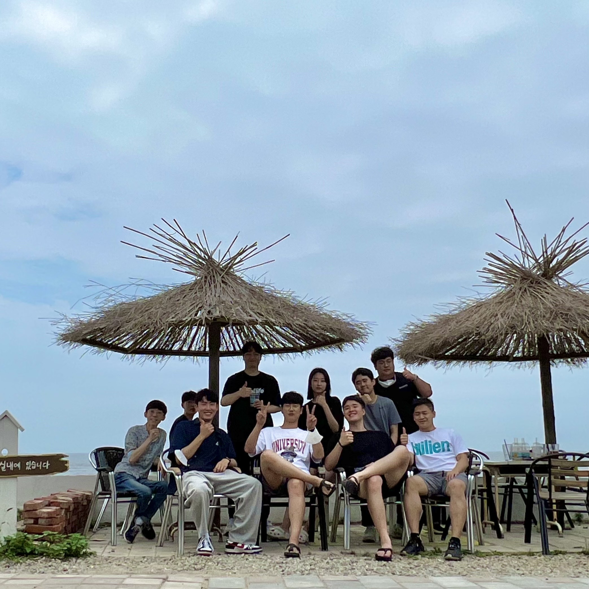

# KHU Vision and Learning Reading Group 

Time
- Tuesday 11:00AM

Location 
- 211-2 Electronic Information College Building

## Table of Contents

- [Current Schedule (Winter 2023)](#current-schedule)
- [Mailing List](#mailing-list)
- [Presenter](#presenters)
- [Previous Meetings](#previous-meetings)
- [Related Links](#related-links)
- [FAQ](#faq)
- [About Us](#about-us)
- [Suggested Papers](#suggested-papers)

## Current Schedule

### Reading Group: 
Please let Hoeyeong Jin (wlsghldud -at- khu -dot- ac -dot- kr) know what paper you are going to present, and **please** provide (name and year) of the conference the paper was accepted and summary by **Friday 11:59pm** before your presentation.

Moreover, send the presentation slides or a link on  **Saturday 11:59pm**.

This Winter we will have Two presenters each week. Presentation duration is up to the presenter (as long as it does not go over an hour:hourglass:).

| Date       |       Presenters     |  Topic     |
|-------------|------------|--------|
| 01/03 |     Jun-Yeong Moon           Junghun Cha     |  S-Prompts Learning with Pre-trained Transformers: An Occam's Razor for Domain Incremental Learning  [[Yabin Wang et el., NeurIPS 2022](https://arxiv.org/abs/2207.12819.pdf)] [[slides](https://docs.google.com/presentation/d/1MqIohxEKlqSFGuXT1g3DAgvPd8hZLSIlrIYzeZQC3rk/edit?usp=sharing)]    SwinIR: Image Restoration Using Swin Transformer [[Jingyun Liang et el., ICCVW 2021](https://arxiv.org/pdf/2108.10257.pdf)] [[slides](https://docs.google.com/presentation/d/1Xa-bdXIsO04oOG3oorhZZGr9WcA5nmKx/edit?usp=sharing&ouid=108538125952274207926&rtpof=true&sd=true)]|
| 01/10 |     Kyungho Bae           Hoeyeong Jin     |   Understanding the Behaviour of Contrastive Loss  [[ Feng Wang, Huaping Liu, CVPR 2021](https://arxiv.org/pdf/2012.09740.pdf)] [[slides]]    Softmax Splatting for Video Frame Interpolation   [[Simon Niklaus, Feng Liu, CVPR 2020](https://arxiv.org/pdf/2003.05534.pdf)] [[slides]] |
| 01/17 |     Enki Cho           Jiwon Hwang     | TBA |
| 01/24 | - | No Meeting. Happy New Year! |
| 01/31 |     Sung Oh           Ju-Won Seo     | TBA |
| 02/07 |     Jongseo Lee           Seunan Choe     | TBA |
| 02/14 |     Taegoo Kang           Minkuk Kim     | TBA |
| 02/21 |     JunBeom Hong           Sunghoon Lee     | TBA |
| 02/28 |     Yuna Jung           Jaeho Lee     | TBA |

## Mailing List

We use Google Groups to manage the mailing list: [(link)](https://groups.google.com/u/2/a/khu.ac.kr/g/khu-vision-and-learning-reading-group-g-groups). You can click "Join Group" when you sign in with your Kyung Hee University account.

## Presenters
Please let Hoeyeong Jin (wlsghldud -at- khu -dot- ac -dot- kr) know what paper you are going to present, and **please** provide (name and year) of the conference the paper was accepted and summary by **Friday 11:59pm** before your presentation.
Moreover, send the presentation slides or a link on  **Saturday 11:59pm**.

* [AGI](https://agi.khu.ac.kr/index.html)
  - M.S. student : Ah-Hyung Shin / Sunghoon Lee / Jiwon Hwang / Jaeho Lee / Seunan Choe / Ju-Won Seo / Jun-Yeong Moon
  - UG student :  Keon-Hee Park / Min-Yeong Park / Do-Hyeong Kim / Minki Kim
* [AUGI](http://ailab.khu.ac.kr/)
  - M.S. student : En-Ki Cho / Yong-Hyun Ahn / Min-Kuk Kim / So-yeon Won
* [MLVC](https://sites.google.com/khu.ac.kr/mlvclab/home?authuser=0)
  - M.S. student : Junghun Cha / Subin Yang / Sung Oh / Jongkyung Im / Taegoo Kang / Yuna Jung / Seoyun Yang / Hoeyeong Jin / Hyeonjun Choi
  - UG student : Yuje Lee / Jeeon Bae / EuiJune Lee / Minseo Kim
* [VLL](https://vll.khu.ac.kr/index.html)
  - M.S. student : Dongho Lee / Jongmin Shin / Hyogun Lee / Kyungho Bae
  - UG student : Jongseo Lee / JunBeom Hong / Junghyun Lee

## Previous Meetings

- [Summer~Fall 2021](https://github.com/khuvll/reading_group/blob/main/2021_Summer_Fall_schedule.md)
- [Winter 2022](https://github.com/khuvll/reading_group/blob/main/2022_Winter_schedule.md)
- [Spring 2022](https://github.com/khuvll/reading_group/blob/main/2022_Spring_schedule.md)
- [Summer 2022](https://github.com/khuvll/reading_group/blob/main/2022_Summer_schedule.md)
- [Fall 2022](https://github.com/khuvll/reading_group/blob/main/2022_Fall_Winter_schedule.md)

## Related Links

#### Resources
- [Awesome Computer Vision](https://github.com/jbhuang0604/awesome-computer-vision)
- [Awesome Deep Vision](https://github.com/kjw0612/awesome-deep-vision)
- [Awesome Action Recognition](https://github.com/jinwchoi/awesome-action-recognition)
- [Computer Vision Foundation open access](http://openaccess.thecvf.com/menu.py)

#### Similar reading group/seminars in other universities
- [MIT Vision Seminars](https://sites.google.com/view/visionseminar)
- [UIUC Vision Lunch](http://vision.cs.illinois.edu/vision_website/)
- [UT-Austin CV Reading Group](http://vision.cs.utexas.edu/readinggroup/)
- [CMU VASC Seminar Series](http://ri.cmu.edu/events/category/vasc-seminar-series/list/?tribe_paged=1&tribe_event_display=past)
- [CMU ML Reading Group](http://www.cs.cmu.edu/~aarti/SMLRG/schedule.html)
- [VT Vision and Learning Reading Group](https://github.com/vt-vl-lab/reading_group)
- [딥러닝 논문 읽기 모임 @ TensorFlow Korea Facebook Group](https://www.youtube.com/playlist?list=PLXiK3f5MOQ760xYLb2eWbtOKOwUC-bByj)

#### Advanced CV courses
- [Advanced Computer Vision](https://filebox.ece.vt.edu/~jbhuang/teaching/ece6554/sp17/index.html) (Jia-Bin Huang, Virginia Tech)
- [Object and Activity Recognition Seminar](https://sites.google.com/site/ucbcs29443/) (Trevor Darrell, UC Berkeley)
- [Visual Learning and Recognition](http://graphics.cs.cmu.edu/courses/16-824/2017_spring/) (Abhinav Gupta, CMU)
- [Visual Recognition](http://vision.cs.utexas.edu/381V-fall2016/) (Kristen Grauman, UT Austin)
- [Advanced Computer Vision](https://filebox.ece.vt.edu/~S16ECE6554/) (Devi Parikh, Georgia Tech)
- [Cutting-Edge Trends in Deep Learning and Recognition](http://slazebni.cs.illinois.edu/spring17) (Svetlana Lazebnik, UIUC)

## FAQ
#### How is the presenters' order generated?
The presenters' order is generated from the presenters' list in a FIFO manner (but the list is initially generated randomly).

#### What should I do if I can not present at the scheduled time?
Contact other presenters to see if they are willing to swap dates with you. Let the group organizer Jongmin/Paul (shinpaul14 -at- khu -dot- ac -dot- kr) know about your situation.

## About Us

#### How it works?
We are a group that meets about once a week to discuss one to two relevant papers. For every meeting, two people will be in charge of selecting the paper(s) for that meeting, thoroughly understanding the work, and leading the discussion (either informally or via a presentation, whatever the leader thinks is best). The rest of the members will read over the paper(s) beforehand to gain a basic idea of the work. Then, on the day of the meeting, we will discuss the strengths, weaknesses, and techniques of the paper(s).

**NOTE:** Please tell the group organizer Jongmin/Paul (shinpaul14 -at- khu -dot- ac -dot- kr) which paper(s) you are going to present, and summarize the paper/talk in several sentences, before the **Monday** of that week.

#### What we read?
We will be reading papers appearing in the leading computer vision conferences (e.g., CVPR, ICCV, ECCV, SIGGRAPH, SIGGRAPH Asia) and machine learning conferences (e.g., NeurIPS, ICML, ICLR), and other AI conferences (e.g., MICCAI, ACL, EMNLP, NAACL, UAI, AAAI, IJCAI, AISTATS). Members are free to choose which paper(s) they will present (we can also provide suggestions), thus the specific topics will vary based on the members' interests.

#### Who can join?
We are open to everyone who is interested, whether you are an undergrad, a grad student, or KHU staff, regardless of department. As long as you are interested in learning more about the fields (by reading cutting-edge research papers), you are welcome to join.

## Suggested Papers

We maintain a pool of suggested papers [here](https://docs.google.com/spreadsheets/d/1tEug71Jg0ucKJfyBy3qisrGZPR49HNdAPeHI1QCu-9A/edit?usp=sharing).

Credits: The contents and formats were modified from [VT Vision and Learning Reading Group](https://github.com/vt-vl-lab/reading_group).
