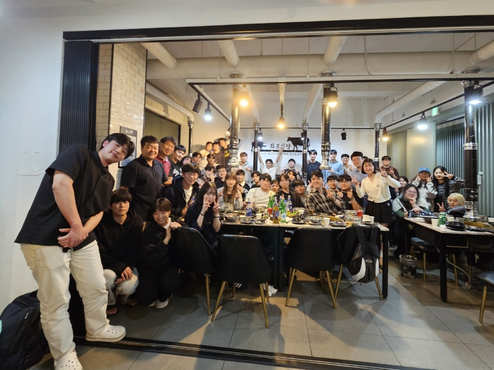

# KHU Vision and Learning Reading Group 

Time
- Tuesday 11:00

Location 
- 211-1 Electronic Information College Building

## Table of Contents

- [Current Schedule (Winter 2026)](#current-schedule)
- [Mailing List](#mailing-list)
- [Presenter](#presenters)
- [Previous Meetings](#previous-meetings)
- [Related Links](#related-links)
- [FAQ](#faq)
- [About Us](#about-us)
- [Suggested Papers](#suggested-papers)

## Current Schedule

### Reading Group: 
Please let  Wooil Lee (lwi2765 -at- khu -dot- ac -dot- kr) know what paper you are going to present, and **please** provide (name and year) of the conference the paper was accepted and summary by **Friday 11:59am** before your presentation.

Moreover, send the **presentation slides link** on  **Monday 11:59pm**.

This Winter we will have Two presenters each week. Presentation duration is up to the presenter (as long as it does not go over an hour).

| Date  | Presenters         | Topic                            |
|-------|--------------------|----------------------------------|
| 01/06 | Kanghyun Lee Geo Ahn | 3DGStream: On-the-Fly Training of 3D Gaussians for Efficient Streaming of Photo-Realistic Free-Viewpoint Videos [[Jiakai Sun et al., CVPR 2024 Highlight](https://arxiv.org/pdf/2403.01444)][[slide](https://docs.google.com/presentation/d/1DSjwkE_M77X_K0_MeCbKOjB8kE1Hfyys/edit?usp=sharing&ouid=115119119176098778407&rtpof=true&sd=true)] Map the Flow: Revealing Hidden Pathways of Information in VideoLLMs [[Minji Kim et al., arXiv 2025](https://arxiv.org/pdf/2510.13251)][[slide](https://docs.google.com/presentation/d/1MaS_SBm39-gjUaRQvghPn-i-KYoy_o3vNe4bj1LIyCg/edit?usp=sharing)] |
| 01/13 | Junhee Lee Hyeon Bae Kim |Towards Zero-Shot Anomaly Detection and Reasoning with Multimodal Large Language Models[[Jiacong Xu et al., CVPR2025 Highlight](https://arxiv.org/pdf/2502.07601)]   Interpreting vision transformers via residual replacement model[[Jinyeong Kim et al., NeurIPS2025](https://arxiv.org/pdf/2509.17401)] |
| 01/20 | Donghoon Kim Junyoung Jung  |   |
| 01/27 | CVPR Rebuttal & ICML deadline | No Reading Group :book: |
| 02/03 | Jiwook Han  Suyeon Kim|   |
| 02/10 | Yong Hyun Ahn   Taegoo Kang|   |
| 02/17 | Seollal Holiday | No Reading Group :book: |
| 02/24 |Subin Park  Wooil Lee|   |

## Mailing List

We use Google Groups to manage the mailing list: [(link)](https://groups.google.com/u/2/a/khu.ac.kr/g/khu-vision-and-learning-reading-group-g-groups). You can click "Join Group" when you sign in with your Kyung Hee University account.

## Presenters
Please let Wooil Lee (lwi2765 -at- khu -dot- ac -dot- kr) know what paper you are going to present, and **please** provide (name and year) of the conference the paper was accepted and summary by **Friday 11:59am** before your presentation.
Moreover, send the **presentation slides link** on  **Monday 11:59pm**.

* [AMI](http://ailab.khu.ac.kr/)
  - Ph.D. student : Enki Cho / Yong Hyun Ahn / Minkuk Kim / Hyeonbae Kim / Youngtae Kim
  - M.S. student : Ohsung Choo / Kayoung Kim / Youngseob Won / Suyoung Yun / Inseong Park
  - UG student : Jeongin Bae / Chiyoung Song
* [ENC lab](https://mlvc.khu.ac.kr/home)
  - Ph.D. student : Sung Oh / Jongkyung Im / Donghoon Kim
  - M.S. student : Myeongjun Oh / Euijin Lee / Junghyun Lee / Soohyun Lee / Junghun Kim
  - UG student : Gibeom Kim
* [VAI](https://visualai.khu.ac.kr/)
  - Ph.D. student : Subin Park
  - M.S. student : Jiyoung Park / Yueun Lee / Chan Lee / Inje Oh / Suyoung Choi / Soyeon Lee / Kanghyun Lee / Junyoung Jung / Seokwon Kim
  - UG student : Haesoo Jung / Minsoo Kim / Hyeok Seung Lee / Minseo Kang
* [VLL](https://vll.khu.ac.kr/index.html)
  - M.S. student : Geo Ahn / Soyeon Hong / Yuri Kim
  - UG student : Jiwook Han / Wooil Lee / Gangmin Choi / Juan Lee / Junpyo Hong / Hyuntak Lee / Chanyoung Roh / Sooa Kim / Sunghun Kim / Junho Kim / Taesoo Park
* [VSLab](https://vslab.khu.ac.kr/)
  - M.S. student : Youngbin Kim / Taeyeong Kim / Myoungchul Kim / Kunho Heo / Seungjae Kim / Wongyu Lee / Youngkwan Cho / Junhee Lee / Suyeon Kim
* Alumni
  - \[AGI] M.S. : Ahyung Shin / Sunghoon Lee / Jaeho Lee / Juwon Seo / Jun-Yeong Moon / Keonhee Park /  Seun-An Choe / Min-Yeong Park / Taeyoung Lee / Min-Jae Kim / UG : Won-Jeong Lee / Habin Lim / Jihyun Park / Taekyun Yoo
  - \[AMI] M.S. : Soyoun Won / Yebin Ji / UG : Jehyun Park
  - \[ENC lab] M.S. : Junghun Cha / Taegoo Kang / Subin Yang / UG : Junseok Yang
  - \[VAI] M.S. : Seungho Shin
  - \[VLL] M.S. : Dongho Lee / Jongmin Shin / Hyogun Lee / Kyungho Bae / Jongseo Lee / UG : Joohyun Chang

## Previous Meetings

- [Summer~Fall 2021](https://github.com/khuvll/reading_group/blob/main/2021_Summer_Fall_schedule.md)
- [Winter 2022](https://github.com/khuvll/reading_group/blob/main/2022_Winter_schedule.md)
- [Spring 2022](https://github.com/khuvll/reading_group/blob/main/2022_Spring_schedule.md)
- [Summer 2022](https://github.com/khuvll/reading_group/blob/main/2022_Summer_schedule.md)
- [Fall 2022](https://github.com/khuvll/reading_group/blob/main/2022_Fall_Winter_schedule.md)
- [Winter~Spring 2023](https://github.com/khuvll/reading_group/blob/main/2023_Winter_Spring_schedule.md)
- [Summer 2023](https://github.com/khuvll/reading_group/blob/main/2023_Summer_schedule.md)
- [Fall 2023](https://github.com/khuvll/reading_group/blob/main/2023_Fall_schedule.md)
- [Winter 2024](https://github.com/KHU-VLL/KHU_Vision_and_Learning_Reading_Group/blob/main/2024_Winter_schedule.md)
- [Spring 2024](https://github.com/KHU-VLL/KHU_Vision_and_Learning_Reading_Group/blob/main/2024_Spring_schedule.md)
- [Summer 2024](https://github.com/KHU-VLL/KHU_Vision_and_Learning_Reading_Group/blob/main/2024_Summer_schedule.md)
- [Fall 2024](https://github.com/KHU-VLL/KHU_Vision_and_Learning_Reading_Group/blob/main/2024_Fall_schedule.md)
- [Winter 2025](https://github.com/KHU-VLL/KHU_Vision_and_Learning_Reading_Group/blob/main/2025_Winter_schedule.md)
- [Spring 2025](https://github.com/KHU-VLL/KHU_Vision_and_Learning_Reading_Group/blob/main/2025_Spring_schedule.md)
- [Summer 2025](https://github.com/KHU-VLL/KHU_Vision_and_Learning_Reading_Group/blob/main/2025_Summer_schedule.md)
- [Fall 2025](https://github.com/KHU-VLL/KHU_Vision_and_Learning_Reading_Group/blob/main/2025_Fall_schedule.md)

## Related Links

#### Resources
- [Awesome Computer Vision](https://github.com/jbhuang0604/awesome-computer-vision)
- [Awesome Deep Vision](https://github.com/kjw0612/awesome-deep-vision)
- [Awesome Action Recognition](https://github.com/jinwchoi/awesome-action-recognition)
- [Computer Vision Foundation open access](http://openaccess.thecvf.com/menu.py)

#### Similar reading group/seminars in other universities
- [MIT Vision Seminars](https://sites.google.com/view/visionseminar)
- [UIUC Vision Lunch](http://vision.cs.illinois.edu/vision_website/)
- [UT-Austin CV Reading Group](http://vision.cs.utexas.edu/readinggroup/)
- [CMU VASC Seminar Series](http://ri.cmu.edu/events/category/vasc-seminar-series/list/?tribe_paged=1&tribe_event_display=past)
- [CMU ML Reading Group](http://www.cs.cmu.edu/~aarti/SMLRG/schedule.html)
- [VT Vision and Learning Reading Group](https://github.com/vt-vl-lab/reading_group)
- [딥러닝 논문 읽기 모임 @ TensorFlow Korea Facebook Group](https://www.youtube.com/playlist?list=PLXiK3f5MOQ760xYLb2eWbtOKOwUC-bByj)

#### Advanced CV courses
- [Advanced Computer Vision](https://filebox.ece.vt.edu/~jbhuang/teaching/ece6554/sp17/index.html) (Jia-Bin Huang, Virginia Tech)
- [Object and Activity Recognition Seminar](https://sites.google.com/site/ucbcs29443/) (Trevor Darrell, UC Berkeley)
- [Visual Learning and Recognition](http://graphics.cs.cmu.edu/courses/16-824/2017_spring/) (Abhinav Gupta, CMU)
- [Visual Recognition](http://vision.cs.utexas.edu/381V-fall2016/) (Kristen Grauman, UT Austin)
- [Advanced Computer Vision](https://filebox.ece.vt.edu/~S16ECE6554/) (Devi Parikh, Georgia Tech)
- [Cutting-Edge Trends in Deep Learning and Recognition](http://slazebni.cs.illinois.edu/spring17) (Svetlana Lazebnik, UIUC)

## FAQ
#### How is the presenters' order generated?
The presenters' order is generated from the presenters' list in a FIFO manner (but the list is initially generated randomly).

#### What should I do if I can not present at the scheduled time?
Contact other presenters to see if they are willing to swap dates with you. Let the group organizer Wooil Lee (lwi2765 -at- khu -dot- ac -dot- kr) know about your situation.

## About Us

#### How it works?
We are a group that meets about once a week to discuss one to two relevant papers. For every meeting, two people will be in charge of selecting the paper(s) for that meeting, thoroughly understanding the work, and leading the discussion (either informally or via a presentation, whatever the leader thinks is best). The rest of the members will read over the paper(s) beforehand to gain a basic idea of the work. Then, on the day of the meeting, we will discuss the strengths, weaknesses, and techniques of the paper(s).

**NOTE:** Please tell the group organizer Wooil Lee (lwi2765 -at- khu -dot- ac -dot- kr) which paper(s) you are going to present, and summarize the paper/talk in several sentences, before the **Friday** of that week.

#### What we read?
We will be reading papers appearing in the leading computer vision conferences (e.g., CVPR, ICCV, ECCV, SIGGRAPH, SIGGRAPH Asia) and machine learning conferences (e.g., NeurIPS, ICML, ICLR), and other AI conferences (e.g., MICCAI, ACL, EMNLP, NAACL, UAI, AAAI, IJCAI, AISTATS). Members are free to choose which paper(s) they will present (we can also provide suggestions), thus the specific topics will vary based on the members' interests.

#### Who can join?
We are open to everyone who is interested, whether you are an undergrad, a grad student, or KHU staff, regardless of department. As long as you are interested in learning more about the fields (by reading cutting-edge research papers), you are welcome to join.

## Suggested Papers

We maintain a pool of suggested papers [here](https://docs.google.com/spreadsheets/d/1tEug71Jg0ucKJfyBy3qisrGZPR49HNdAPeHI1QCu-9A/edit?usp=sharing).

Credits: The contents and formats were modified from [VT Vision and Learning Reading Group](https://github.com/vt-vl-lab/reading_group).
