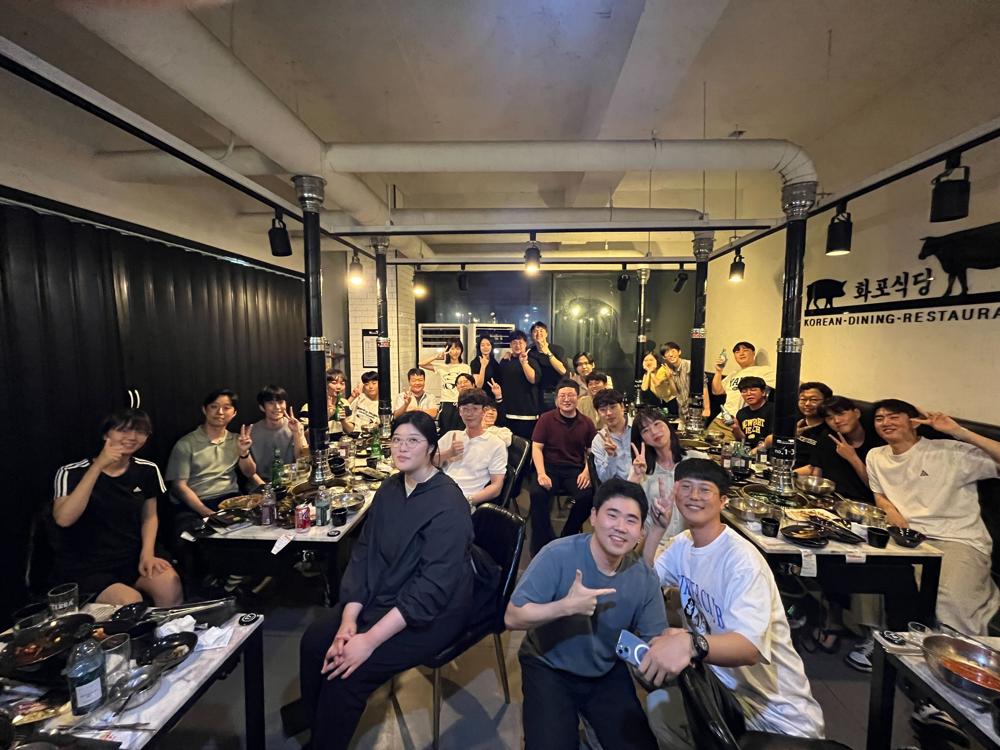

# KHU Vision and Learning Reading Group 

Time
- Wednesday 19:00

Location 
- 211-1 Electronic Information College Building

## Table of Contents

- [Current Schedule (Fall 2023)](#current-schedule)
- [Mailing List](#mailing-list)
- [Presenter](#presenters)
- [Previous Meetings](#previous-meetings)
- [Related Links](#related-links)
- [FAQ](#faq)
- [About Us](#about-us)
- [Suggested Papers](#suggested-papers)

## Current Schedule

### Reading Group: 
Please let Jiwon Hwang (tdj03204 -at- khu -dot- ac -dot- kr) know what paper you are going to present, and **please** provide (name and year) of the conference the paper was accepted and summary by **Sunday 11:59pm** before your presentation.

Moreover, send the **presentation slides link** on  **Tuesday 11:59pm**.

This Fall we will have one presenter each week. Presentation duration is up to the presenter (as long as it does not go over an hour:hourglass:).

| Date  | Presenters         | Topic                            |
|-------|--------------------|----------------------------------|
| 09/13 | Seun-An Choe       | BAPA-Net: Boundary Adaptation and Prototype Alignment for Cross-domain Semantic Segmentation  [[Yahao Liu, et al., ICCV 2021](https://openaccess.thecvf.com/content/ICCV2021/papers/Liu_BAPA-Net_Boundary_Adaptation_and_Prototype_Alignment_for_Cross-Domain_Semantic_Segmentation_ICCV_2021_paper.pdf)] [[slides](https://docs.google.com/presentation/d/1cYzcom1aFIIADhK9cj9zKtMMDkOQGxOirCTq9Y3zqCU/edit?usp=sharing)] |
| 09/20 | Hyogun Lee         | Efficiently Modeling Long Sequences with Structured State Spaces  [[Albert Gu, et al., ICLR 2022](https://arxiv.org/pdf/2111.00396.pdf)] [[slides](https://docs.google.com/presentation/d/1TKeWxHiiQoptgS7R-7BsoVWHbl6tnmuzN34WkYzkhD0)] |
| 09/27 | Soyeon Hong        | Egocentric Video-Language Pretraining  [[Kevin Qinghong Lin et al., NeurIPS 2022](https://arxiv.org/pdf/2206.01670.pdf)] [[slides](https://docs.google.com/presentation/d/1O7SEUYQkcNLK6kSeYvciNAuCRyx8Ri-F)] |
| 10/04 | Jongseo Lee        | SketchXAI: A First Look at Explainability for Human Sketches  [[Zhiyu Qu et al., CVPR 2023](https://openaccess.thecvf.com/content/CVPR2023/papers/Qu_SketchXAI_A_First_Look_at_Explainability_for_Human_Sketches_CVPR_2023_paper.pdf)] [[slides](https://docs.google.com/presentation/d/15cpQkSLe64AprzrM0a063n7XRS1EB8tg)] |
| 10/11 | Enki Cho           | Associating Objects with Transformers for Video Object Segmentation  [[Zongxin Yang et al., NeurIPS 2021](https://arxiv.org/pdf/2106.02638.pdf)] [[slides](https://docs.google.com/presentation/d/1RbvkOW1DP-1YTNN6ujShAdg5G1fXnTEq/)] |
| 10/18 | Midterm            | No Reading Group. :book:         |
| 10/25 | Midterm            | No Reading Group. :book:         |
| 11/01 | Hoeyeong Jin       | Consistency Models  [[Yang Song, et al., ICML 2023](https://arxiv.org/pdf/2303.01469.pdf)] [[slides](https://docs.google.com/presentation/d/1rh1q7urRs8OOWt4svfgNZECHOFNm48OL)] |
| 11/08 | Seoyun Yang        | IBRNet: Learning Multi-View Image-Based Rendering  [[Qianqian Wang et al., CVPR 2021](https://openaccess.thecvf.com/content/CVPR2021/papers/Wang_IBRNet_Learning_Multi-View_Image-Based_Rendering_CVPR_2021_paper.pdf)] [[slides](https://drive.google.com/file/d/1BNFfue895NBKi-0hS628gbtDZUVbPjWx)] |
| 11/15 | CVPR 2024 Deadline | No Reading Group. :book:         |
| 11/22 | Jaeho Lee          | Aging with GRACE: Lifelong Model Editing with Discrete Key-Value Adaptors  [[Thomas Hartvigsen et al., NeurIPS 2023](https://openreview.net/pdf?id=Oc1SIKxwdV)] [[slides](https://docs.google.com/presentation/d/1gcGImzowYaeQ2GFFDVuYOhcq6bC5vquB)] |
| 11/29 | Jongseo Lee        | CAST: Cross-Attention in Space and Time for Video Action Recognition  [[Dongho Lee, Jongseo Lee, and Jinwoo Choi, NeurIPS 2023](https://openreview.net/pdf?id=iATY9W5Xw7)] [[slides](https://1drv.ms/p/s!AqsQKNxrFUaJiXrVnEZcYPJQo5sr)] |
| 12/06 | Soyoun Won         | *TBA*  [[link](#)] [[slides](#)] |
| 12/13 | Final              | No Reading Group. :book:         |
| 12/20 | Final              | No Reading Group. :book:         |
| 12/27 | Euijune Lee        | *TBA*  [[link](#)] [[slides](#)] |

## Mailing List

We use Google Groups to manage the mailing list: [(link)](https://groups.google.com/u/2/a/khu.ac.kr/g/khu-vision-and-learning-reading-group-g-groups). You can click "Join Group" when you sign in with your Kyung Hee University account.

## Presenters
Please let Jiwon Hwang (tdj03204 -at- khu -dot- ac -dot- kr) know what paper you are going to present, and **please** provide (name and year) of the conference the paper was accepted and summary by **Sunday 11:59pm** before your presentation.
Moreover, send the **presentation slides link** on  **Tuesday 11:59pm**.

* [AGI](https://agi.khu.ac.kr/index.html)
  - M.S. student : Sunghoon Lee / Jiwon Hwang / Jaeho Lee / Juwon Seo / Jun-Yeong Moon / Keonhee Park /  Seun-An Choe / Min-Yeong Park / Taeyoung Lee
  - UG student : Min-Jae Kim
* [AUGI](http://ailab.khu.ac.kr/)
  - M.S. student : Enki Cho / Yong Hyun Ahn / Minkuk Kim / Soyoun Won / Hyeonbae Kim / Yebin Ji
* [MLVC](https://sites.google.com/khu.ac.kr/mlvclab/home?authuser=0)
  - M.S. student : Subin Yang / Sung Oh / Jongkyung Lim / Taegoo Kang / Seoyun Yang / Hoeyeong Jin / DongHoon Kim
  - UG student :  Euijune Lee
* [VLL](https://vll.khu.ac.kr/index.html)
  - M.S. student : Hyogun Lee / Kyungho Bae / Jongseo Lee
  - UG student : Geo Ahn / Soyeon Hong
* Alumni
  - \[AGI] M.S. : Ahyung Shin
  - \[MLVC] M.S. : Junghun Cha
  - \[VLL] M.S. : Dongho Lee / Jongmin Shin

## Previous Meetings

- [Summer~Fall 2021](https://github.com/khuvll/reading_group/blob/main/2021_Summer_Fall_schedule.md)
- [Winter 2022](https://github.com/khuvll/reading_group/blob/main/2022_Winter_schedule.md)
- [Spring 2022](https://github.com/khuvll/reading_group/blob/main/2022_Spring_schedule.md)
- [Summer 2022](https://github.com/khuvll/reading_group/blob/main/2022_Summer_schedule.md)
- [Fall 2022](https://github.com/khuvll/reading_group/blob/main/2022_Fall_Winter_schedule.md)
- [Winter~Spring 2023](https://github.com/khuvll/reading_group/blob/main/2023_Winter_Spring_schedule.md)
- [Summer 2023](https://github.com/khuvll/reading_group/blob/main/2023_Summer_schedule.md)

## Related Links

#### Resources
- [Awesome Computer Vision](https://github.com/jbhuang0604/awesome-computer-vision)
- [Awesome Deep Vision](https://github.com/kjw0612/awesome-deep-vision)
- [Awesome Action Recognition](https://github.com/jinwchoi/awesome-action-recognition)
- [Computer Vision Foundation open access](http://openaccess.thecvf.com/menu.py)

#### Similar reading group/seminars in other universities
- [MIT Vision Seminars](https://sites.google.com/view/visionseminar)
- [UIUC Vision Lunch](http://vision.cs.illinois.edu/vision_website/)
- [UT-Austin CV Reading Group](http://vision.cs.utexas.edu/readinggroup/)
- [CMU VASC Seminar Series](http://ri.cmu.edu/events/category/vasc-seminar-series/list/?tribe_paged=1&tribe_event_display=past)
- [CMU ML Reading Group](http://www.cs.cmu.edu/~aarti/SMLRG/schedule.html)
- [VT Vision and Learning Reading Group](https://github.com/vt-vl-lab/reading_group)
- [딥러닝 논문 읽기 모임 @ TensorFlow Korea Facebook Group](https://www.youtube.com/playlist?list=PLXiK3f5MOQ760xYLb2eWbtOKOwUC-bByj)

#### Advanced CV courses
- [Advanced Computer Vision](https://filebox.ece.vt.edu/~jbhuang/teaching/ece6554/sp17/index.html) (Jia-Bin Huang, Virginia Tech)
- [Object and Activity Recognition Seminar](https://sites.google.com/site/ucbcs29443/) (Trevor Darrell, UC Berkeley)
- [Visual Learning and Recognition](http://graphics.cs.cmu.edu/courses/16-824/2017_spring/) (Abhinav Gupta, CMU)
- [Visual Recognition](http://vision.cs.utexas.edu/381V-fall2016/) (Kristen Grauman, UT Austin)
- [Advanced Computer Vision](https://filebox.ece.vt.edu/~S16ECE6554/) (Devi Parikh, Georgia Tech)
- [Cutting-Edge Trends in Deep Learning and Recognition](http://slazebni.cs.illinois.edu/spring17) (Svetlana Lazebnik, UIUC)

## FAQ
#### How is the presenters' order generated?
The presenters' order is generated from the presenters' list in a FIFO manner (but the list is initially generated randomly).

#### What should I do if I can not present at the scheduled time?
Contact other presenters to see if they are willing to swap dates with you. Let the group organizer Jiwon Hwang (tdj03204 -at- khu -dot- ac -dot- kr) know about your situation.

## About Us

#### How it works?
We are a group that meets about once a week to discuss one to two relevant papers. For every meeting, two people will be in charge of selecting the paper(s) for that meeting, thoroughly understanding the work, and leading the discussion (either informally or via a presentation, whatever the leader thinks is best). The rest of the members will read over the paper(s) beforehand to gain a basic idea of the work. Then, on the day of the meeting, we will discuss the strengths, weaknesses, and techniques of the paper(s).

**NOTE:** Please tell the group organizer Jiwon Hwang (tdj03204 -at- khu -dot- ac -dot- kr) which paper(s) you are going to present, and summarize the paper/talk in several sentences, before the **Monday** of that week.

#### What we read?
We will be reading papers appearing in the leading computer vision conferences (e.g., CVPR, ICCV, ECCV, SIGGRAPH, SIGGRAPH Asia) and machine learning conferences (e.g., NeurIPS, ICML, ICLR), and other AI conferences (e.g., MICCAI, ACL, EMNLP, NAACL, UAI, AAAI, IJCAI, AISTATS). Members are free to choose which paper(s) they will present (we can also provide suggestions), thus the specific topics will vary based on the members' interests.

#### Who can join?
We are open to everyone who is interested, whether you are an undergrad, a grad student, or KHU staff, regardless of department. As long as you are interested in learning more about the fields (by reading cutting-edge research papers), you are welcome to join.

## Suggested Papers

We maintain a pool of suggested papers [here](https://docs.google.com/spreadsheets/d/1tEug71Jg0ucKJfyBy3qisrGZPR49HNdAPeHI1QCu-9A/edit?usp=sharing).

Credits: The contents and formats were modified from [VT Vision and Learning Reading Group](https://github.com/vt-vl-lab/reading_group).
